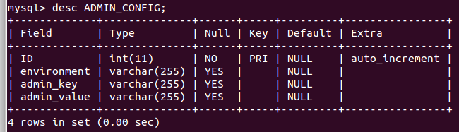

#Requirement for the Mediaserver

.png)

* * *
* * *
#Versionhistory
Date | Version | Author | Description
------------- | ------------- | ------------- | -------------
2013-03-21  | version 1  | ingimar.erlingsson@nrm.se  | original
2015-02-01  | version 2  | ingimar.erlingsson@nrm.se  | moving from .odt to .md
<date>  | <version>  | <email>  | <desc>

## About DINA
“ The DINA system is comprised of several parts, the most important one being the Specify database and its client software. Various different types of media (including documents) are proposed to be handled by the DINA system and there is a need for a simple, yet flexible storage system which can be accessed by the various parts of the DINA system “ 
- from the draft document 'DINA attachment-server: A simple Approach'

Every DINA-module is self-contained and is therefore deployable in an application server.

#Introduction to the Mediaserver
This document is the requirment document for the Mediaserver.
The Mediaserver (aka. 'attachment server')  handles mediafiles and their metadata and  tags.
The Mediaserver is a DINA module.

## The purpose
The scope of the Mediaserver is small and should be kept at a minimum.
The purpose of the Mediaserver is to serve other modules/system with storing and retrieving binaries.

The Mediaservers responsibility is: 

1. Storing : 

1.1 Storing binaries to the filesystem and Storing the metadata/tags to a database. 

2. Retrieving: 

2.1 Retrieving the binaries and retrieving the metadata for the binaries 

3. update and delete binaries and metadata

adding new feature ...
When adding new features it should be done .... 

## The work
The Mediaserver will be developed in stages ( see Milestones and the requirements below ).

##Glossary
When we mention mediafiles in this document we are referring to  the following entities.

1. Image: its metadata and tags. 
2. Sound: its metadata and tags. 
3. Video : its metadata and tags. 
4. 3D : its metadata and tags. 
5. Attachment : its metadata and tags

Where : image, Sound, Video, 3D and Attachment are binaries.

#Technology choices
Java SE6 or higher, JEE6 or higher. 

- right now EJB 3.x is beeing used ( need , application server such as glassfish or wildfly).
- relational database is used .

- JEE6-stack or higher (stack includes EJB 3.x, JPA 2.x , JAX-RS and soforth)
- - database agnostic, gained by using liquibase 
- tested with Mysql 5.5, postgres 9.x
- Application Server agnostic
- - tested with Glassfish 3.x , Wildfly 8.x

## Constraints (guidance when developing)
- No dependency on a JEE framework.
- No User management.
- No Events-logging.
- No metadata is writeen back to the binary.
- No UI.
- No dependency on a specific database provider
- No dependecny on a spacific Application server

* * *
* * *
#Functional requirements
##Basic Service
The Mediaserver should provide services for other systems :  i.e. naturforskaren/ 'the Naturalist'  & the DINA-system.

1. To store mediafiles (Create)
2. To edit mediafiles (Update)
3. To search for mediafiles (Retrieve) using metadata/tags
4. To delete/disable mediafiles (delete)

### Storing the mediafiles 
All medifiles are stored using UUID as names. 

UUID, " Universally unique identifier, 128-bit number." ( http://tools.ietf.org/html/rfc4122) 

The mediafiles are stored in the filesystem with the depth of 3 layers.
Only one image is stored, no derivates are created at the same time.

The structure is that there are directories ranging from '0' to 'F' (hexadecimal) with the depth of 3 layers, this gives 4096 directories ( 16^3 ).

Ex. Say that we have 10 000 000 ( ten millions ) mediafiles, with an even spread this would give 2441 mediafiles per directory. 

All mediafiles are processed in the same way regarding that they are streamed to the filesystem and streamed back to their client.

The mediafile will hold their own 'media-type'/'mime-type' ( stored in the database )

- The principle is the following : 
- - if the generated UUID is **'ab30899c-58a0-4305-85a6-bbfa14f89b92'**
- Then the file is stored in the following directory ( subdirectory is made up by the first 3 chars ):
- - directory = **/opt/data/mediaserver/newmedia/a/b/3**
- - directory and file = /opt/data/mediaserver/newmedia/a/b/3/**ab30899c-58a0-4305-85a6-bbfa14f89b92**

### Metadata and Tags
a Distinguish between metadata and tags
#### Tags , about the content
Generics tags are supported and saved as a text-string in the database. 

- ':' is used as the delimiter between key and its value.
- '&' is used as the delimiter between key/value-pairs  

<b>i.e setting key='country' with value='sweden' and key='view' with value='dorsal'. </b>

<b>gives the following textstring => 'country:sweden&value=dorsal'</b> 

The Mediaserver sets no constraint on the keys that are used.  

This gives an external module using the Mediaserver freedom to define its own keys and constrain others keys.

#### metadata , about the file
such as
- orignal filename 

- mime type 

- owner 

- visibility 

- - a text-field, suggested input 'private' and 'public'
- md5hash 

- - Saving a md5hash for every mediafile, facilitates finding duplicates in the future.

### Exif
To store Exif-metadata for Mediafiles of type images.
Exif-metadata is stored in a table of its own.

### coupling the Mediaserver to an external module
A table will be created to couple an external module to the mediaserver.
For instance : 
'the Naturalist' , the Naturalist 'taxon-UUID' will map to one or many  'media-UUID'.

### Control over the  licenses
Licences will be stored in a licence-table.
This gives the administrator full control of what licenses are permitted in the system.

## Maintenability
It is important to consider ease of maintenability for the future 'configuration manager' of the Mediaserver.

### Ease of installation
- to download and build the source code
- to install and populate the chosen database-engine
- to deploy the service
- Application  server :  how-to set up a datasource/datapool/JNDI-handle
- to set the filesystem path for the mediafiles

A table ( key/value) in the schema is used for managing settables :
For instance the below ( key/value ) is set in the database.

1. is_exif = [true||false]
2. path_to_files = '/opt/data/mediaserver/newmedia'

### demo-data provided with the mediaserver
- Ability to verify the installation

### A demo application ( acting as an external module ) is provided
Mediaserver + 'demo SimpleTaxonMock'. 

- [mediaserver](https://github.com/Inkimar/dina-mediaserver "dina mediaserver").

- [demo SimpleTaxonMock ](https://github.com/Inkimar/dina-mediaserver-demo "dina mediaserver demo").

## Single-Sign-On
- N/A

## Security
- N/A

* * *

#Additional Documents

* * *

#Milestones
In all Milestones, RESTful API:s are created to facitlitate the functionality.

##Milestone 1 
Goal :  Minimum Mediaserver functionality &  integration with 'the Naturalist'.

1. Mediafiles and a subset of their Metadata  

1.1 Implement CRUD :  Images and  Sound 

2. Database Structure  

2.1. Create the schema for the database.  

2.2. Database agnostic , should be easy to change database-engine  

3. It should be possible to tag the mediafiles.  

3.1. Tag-entity ( implemented as key/value)  

4. 'linkage'-table to an external system.  

4.1. to couple a 'taxon' from  'the Naturalist' to #medifiles [ one-to-many] 

To create a 'demo with a user interface'.  

1. to store images/sound and their metadata.  

2. to store metadata in a string (key/value) : i.e 'view=left'.  

3. to search for a 'key/value' and present the mediafile(s).  

##Milestone 2
Goal   : Export data from 'the Naturalist'  to the Mediaserver + *integrate* . 

1.  Export Data ( Mediafiles + their Metadata ) from 'the Naturalist'  to the Mediaserver  

1.1.  Move the Mediafiles  from  'the Naturalist'   to the Mediaserver 

2.  Integrate  'the Naturalist' with the Mediaserver  

2.1 read : refactor the code in 'the Naturalist' 

3. Validate the integration:  

3.1 Ability to search on a taxon in 'the Naturalist' and get a response from the Mediaserver 

3.1.1 #mediafiles will be returned and displayed  

4.  'the Naturalist'  adminstration UI  

4.1 Ability to add mediafiles, store them in the Mediaserver ( coupled to taxon ) 

5. Validate the admin-integration 

##Milestone 3 
Goal : Added functionality.

1. Ability to tag Sound- and Video-files 

1.1 either start+duration or start- and end-time 

2. To return image-files with another dimension 

2.1 return the 'derivate' on the fly 

3. To store Exif-information in the database 

3.1 A 'configuration manager' for the mediaserver should be able to set a flag ( true or false) in the database ( false = no Exif-metadata will be stored, true = Exif-metadata is stored).

##Milestone 4
Integration  with Specify 

1. gather/dig for requirments that the Specify-team has on the Mediaserver 

2. structure requirements

3. Implement requirements

Questions:
Which version of Specify, version 6 or 7 ?

##Milestone 5
Integration  with Morphank 

1. Observe that Morphbank only stores images today ( 2014-12-06 ) 

2. An easy way to configure which Morphbank installation to export to. 

2.1 i.e the Swedish-morphbank installation 

3. Using an 'export' check-box when images + metadata should be exported to morphbank. 

Questions:
1.Single-Sign-On , ability to login into the mediaserver + morphbank. 

2. when successfully exported a morphbank-ID needs to be stored in the Mediaserver ?

##Milestone XX
implement the DINA RESTful standard when that standard is finalized.

- [dina-api-std.html](http://dina-collections.github.io/dina-api-std.html "dina-api-std.html").

# Technologies , used under development
1. Operating System : GNU/Linux ( Ubuntu version 14.x ) 

2. JDK 1.7.x 

3. JEE6-stack / JEE7-stack 

3.1 EJB 3.x 

3.2 JPA ( implemented by Eclipselink ) 

3.3 JAX-RS ( implemented by RESTeasy) 

4. Databases (liquibase for database agnostic) 

4.1 MySQL 5.x 

4.2 PostgreSQL 9.x 

5. maven 

5.1 " Apache Maven is a software project management and comprehension tool.  " 

6 IDE 

6.1 Netbeans 7.x and 8.x has been used 

7.0 utils 

7.1 metadata extractor : https://drewnoakes.com/code/exif/ 

7.2 for resizing images : 

7.2.1  http://projects.coobird.net/thumbnailator/   

7.2.3 https://code.google.com/p/thumbnailator/ 

#Appendix A

## technologies
- liquibase : http://www.liquibase.org/ 
- maven : http://maven.apache.org/

## services
- naturforskaren : 'the naturalist' , http://www.naturforskaren.se/ 
- specify : http://specifyx.specifysoftware.org/
- morphank:  http://www.morphbank.net/

## additional
- Exif : Exchangeable image file format 
- - http://en.wikipedia.org/wiki/Exchangeable_image_file_format

- media-types: 
- - http://www.iana.org/assignments/media-types 

- RESTeasy
- - http://resteasy.jboss.org/ 

